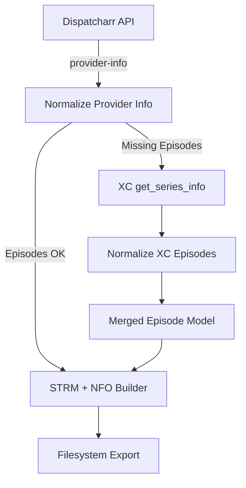

# VOD2strm — Dispatcharr → STRM/NFO Exporter  
  
  
  


## 📌 Overview

**VOD2strm** is a high-reliability Python exporter for converting your **Dispatcharr VOD library** into a clean filesystem of:

- `*.strm` streaming pointer files  
- `*.nfo` metadata files  
- Posters & fanart (when available)  
- Deterministic folder structures  
- Fully cached provider-info + XC fallback metadata  

Compatible with **Emby**, **Jellyfin**, **Plex**, and any STRM/NFO aware media system.

Everything is driven via the **Dispatcharr API** — no playlist parsing, no M3U processing.

---

## 🚀 Quickstart Diagram



---

## ✨ Key Features

### 🎬 Movies
- Full STRM + NFO generation  
- Proper movie folder layout  
- Cached artwork downloads  
- Clean title normalization  
- Proxy-friendly stream URLs  

### 📺 Series
- Series → Seasons → Episodes filesystem  
- `tvshow.nfo` + per-episode `*.nfo`  
- Normalised episode objects (Dispatcharr & XC unified)  
- Cached provider-info per account  
- **Automatic XC fallback** when needed  
- Correct ordering & deduplication  

### 🗃️ Caching
- Each account has isolated cache under `cache/<account>/`  
- Cached:
  - provider-info  
  - XC get_series_info  
  - artwork  
- Re-runs are fast — only changed episodes are processed  

### ⚙️ Configurable
- DRY-RUN mode  
- CLEAR_CACHE mode  
- LOG_LEVEL (`DEBUG`, `INFO`, `WARN`, `ERROR`)  
- Account filtering  
- Directory-agnostic (`SCRIPT_DIR`)  

---

## ⚠️ TEMPORARY EPISODE FALLBACK (IMPORTANT)

Dispatcharr currently has an outstanding bug where:

```
GET /api/vod/series/<id>/provider-info/?include_episodes=true
```

often returns **no episodes**, or hits an internal:

```
500 Internal Server Error
```

Until this is fixed, VOD2strm performs a **safe, minimal XC fallback**.

### ✔️ XC Fallback Workflow
1. Call Dispatcharr provider-info  
2. If **episodes exist → use them**  
3. If **missing episodes → fallback triggers (if enabled)**  
4. XC endpoint called:  
   ```
   /player_api.php?username=<USER>&password=<PASS>&action=get_series_info&series_id=<ID>
   ```  
5. XC episodes are normalised  
6. Data merged (primary: Dispatcharr → fallback: XC)  
7. Export proceeds normally

### 🔒 How to Disable (once fixed upstream)

Add to `VOD2strm_vars.sh`:

```bash
export ENABLE_XC_EPISODE_FALLBACK="false"
```

Or at runtime:

```bash
ENABLE_XC_EPISODE_FALLBACK=false ./VOD2strm.py
```

### 📝 This fallback will be **removed entirely** in VOD2strm **1.0.0**.

---

## 📁 Output Structure

### Movies
```
Movies/
  <Category>/
    <Title (Year)>/
      movie.nfo
      poster.jpg
      fanart.jpg
      movie.strm
```

### Series
```
Series/
  <Category>/
    <Show Name>/
      tvshow.nfo
      poster.jpg
      fanart.jpg
      Season 01/
        S01E01 - Episode Title.strm
        S01E01 - Episode Title.nfo
      Season 02/
        ...
```

Category fallback priority:

```
genre → category_name → "Unsorted"
```

---

## 🔧 Configuration (VOD2strm_vars.sh)

| Variable | Description |
|---------|-------------|
| `DISPATCHARR_URL` | Base Dispatcharr URL |
| `API_TOKEN` | API key |
| `OUTPUT_ROOT` | Root export directory |
| `CACHE_DIR` | Override cache directory |
| `LOG_LEVEL` | DEBUG / INFO / WARN / ERROR |
| `CLEAR_CACHE` | true = wipe cache before run |
| `DRY_RUN` | true = do not write files |
| `ENABLE_XC_EPISODE_FALLBACK` | true/false toggle |
| `ACCOUNT_FILTERS` | Process only named accounts |

---

## ▶️ Running

Normal:

```
./VOD2strm.py
```

Verbose:

```
LOG_LEVEL=INFO ./VOD2strm.py
```

Dry run:

```
DRY_RUN=true ./VOD2strm.py
```

Clear caches:

```
CLEAR_CACHE=true ./VOD2strm.py
```

Source vars file:

```
source ./VOD2strm_vars.sh
./VOD2strm.py
```

---

## ⚡ Performance (example from Strong 8K)

| Stage | Time |
|-------|------|
| Movies fetch | ~180s |
| Series fetch | ~45s |
| Exported | ~17,500 movies / ~4,200 series / 75k+ episodes |

---

## 🧩 Known Issues

| Issue | Status |
|-------|--------|
| Dispatcharr `/provider-info` episodes bug | Mitigated by fallback |
| XC throttling | Auto-retry + caching |
| Missing artwork | Planned |
| Minimal NFO | Being expanded |

---

## 🏷️ Versioning Strategy

- **0.9.x** — Current builds, includes XC fallback  
- **1.0.0** — Remove fallback once Dispatcharr fixes episode API  
- **1.x** — Performance, metadata expansion, async options  

---

## 🤝 Contributing

PRs welcome once public.  
Please open issues for:

- CI/CD  
- Provider inconsistencies  
- NFO schema improvements  
- Large library performance tuning  

---

## 📜 License

Private homelab utility — no warranty.
